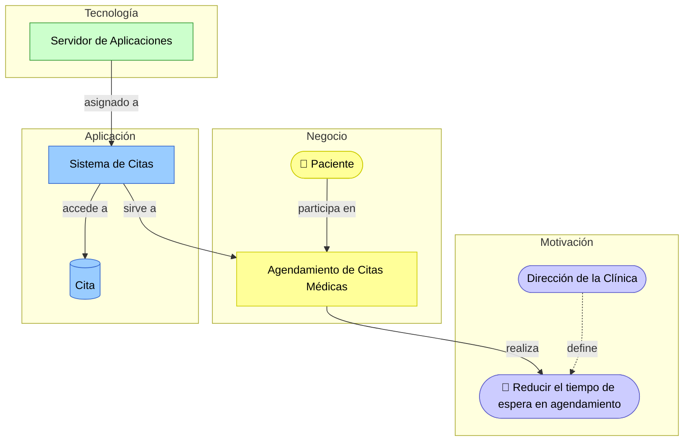

# 🧭 Guía de Notación ArchiMate

ArchiMate es el **estándar principal de modelado** de este curso: cada capa de la arquitectura (negocio, aplicación, tecnología) se documenta con ArchiMate, apoyándose en BPMN, ERD y C4 cuando se necesite el detalle que ArchiMate no está pensado para dar.

**TOGAF y ArchiMate no compiten, se complementan:** TOGAF ADM es el *método* — la secuencia de fases que ya siguen los Talleres 0 a 9. ArchiMate es el *lenguaje* — la notación con la que se dibuja lo que cada fase produce. Por eso cada guía del curso incluye ahora una sección "Vista ArchiMate equivalente": no reemplaza el BPMN/C4/ERD que ya construyó, muestra cómo ese mismo trabajo se ve con el lenguaje común que debe leer cualquier persona del comité, sin importar qué taller lo produjo.

---

## 1. Las capas de ArchiMate

| Capa | Color estándar | Qué modela | Se usa principalmente en |
|---|---|---|---|
| Motivación | Lila | Por qué se hace algo: stakeholders, objetivos, requerimientos | Taller 0 |
| Negocio | Amarillo | Quién hace qué en la organización: actores, procesos, servicios | Taller 1 |
| Aplicación | Azul | Qué sistemas soportan al negocio: componentes, servicios, datos | Talleres 2 y 3 |
| Tecnología | Verde | Sobre qué infraestructura corre todo: nodos, dispositivos, redes | Taller 4 |
| Implementación y Migración | Naranja | Cómo se pasa del AS-IS al TO-BE: plateaus, brechas, paquetes de trabajo | Talleres 7 y 9 |

No hay una capa de "seguridad" ni de "normatividad" — los hallazgos de los Talleres 5 y 6 se modelan como elementos de **Motivación** (Requirement, Constraint) que influyen sobre elementos de las otras capas. Esto se explica en la sección 5.

---

## 2. Elementos principales por capa

### Motivación (lila)

| Elemento | Representa | Ejemplo |
|---|---|---|
| Stakeholder | Alguien con interés en la arquitectura | Dirección de la Clínica |
| Driver | Una fuerza interna o externa que motiva el cambio | Presión competitiva, nueva regulación |
| Goal | Un objetivo estratégico de alto nivel | "Reducir el tiempo de espera en agendamiento" |
| Requirement | Algo que la arquitectura debe cumplir | "El sistema debe cifrar datos de pago" (viene del Taller 5) |
| Constraint | Una restricción que limita el diseño | "No se puede cambiar el ERP en 2025" (viene de la Ficha, Taller 0) |

### Negocio (amarillo)

| Elemento | Representa | Ejemplo |
|---|---|---|
| Business Actor | Una persona o entidad concreta | Paciente |
| Business Role | Una responsabilidad que un actor desempeña | Médico tratante |
| Business Process | Una secuencia de actividades que produce un resultado (nivel resumen, no el detalle de un BPMN) | Agendamiento de Citas Médicas |
| Business Service | Un servicio que el negocio expone hacia afuera | Servicio de Agendamiento |
| Business Object | Información relevante para el negocio | Historia Clínica |

### Aplicación (azul)

| Elemento | Representa | Ejemplo |
|---|---|---|
| Application Component | Una pieza de software con una responsabilidad (equivalente a un contenedor del C2) | Sistema de Citas |
| Application Service | Una función que un componente expone a otros | Servicio de Consulta de Disponibilidad |
| Application Interface | El punto de acceso a un servicio | API REST |
| Data Object | Datos manejados por una aplicación (equivalente a una entidad del ERD) | Cita |

### Tecnología (verde)

| Elemento | Representa | Ejemplo |
|---|---|---|
| Node | Un recurso de cómputo (físico o virtual) | Servidor de Aplicaciones |
| Device | Hardware físico | Balanceador de Carga |
| Technology Service | Un servicio de infraestructura | Servicio de Hosting |
| Artifact | Un producto de software desplegado | Contenedor Docker del Sistema de Citas |

### Implementación y Migración (naranja)

| Elemento | Representa | Ejemplo |
|---|---|---|
| Plateau | Un estado estable de la arquitectura en el tiempo | "Arquitectura AS-IS 2026", "Arquitectura TO-BE 2027" |
| Gap | La diferencia entre dos plateaus | "Falta sincronización en tiempo real" (Taller 7) |
| Work Package | Un paquete de trabajo que cierra una brecha | Cada fase del Plan de Implementación (Taller 9) |

---

## 3. Relaciones principales

| Relación | Símbolo | Significado | Ejemplo |
|---|---|---|---|
| Serving | flecha simple → | Un elemento presta un servicio a otro | Sistema de Citas *sirve a* Agendamiento de Citas |
| Realization | flecha punteada con triángulo | Un elemento concreto materializa uno más abstracto | Servicio de Agendamiento *realiza* el Goal "Reducir tiempo de espera" |
| Assignment | línea con círculo relleno | Un elemento ejecuta o es responsable de otro | Servidor de Aplicaciones *asignado a* Sistema de Citas |
| Triggering | flecha sólida | Un elemento dispara la ocurrencia de otro | Solicitud de cita *dispara* Confirmación |
| Flow | flecha punteada | Traslado de información o valor | Datos de la cita *fluyen* hacia Facturación |
| Access | línea punteada simple | Un elemento lee/escribe un dato | Sistema de Citas *accede* al Data Object Cita |
| Composition / Aggregation | línea con diamante | Un elemento es parte de otro | Motor de Rutas *es parte de* Plataforma RedExpress |

---

## 4. Metodología en 4 pasos para construir una vista ArchiMate

1. **Elegir el viewpoint** — ¿qué pregunta responde esta vista? ("¿cómo el negocio usa la tecnología?", "¿qué brechas hay entre AS-IS y TO-BE?"). Una vista que intenta responder todo termina sin responder nada.
2. **Identificar los elementos por capa** relevantes a esa pregunta — no incluya una capa completa si el viewpoint no la necesita.
3. **Conectar con la relación semánticamente correcta** — nunca use una "asociación" genérica si existe un verbo más preciso (sirve, realiza, está asignado a, dispara, fluye, accede).
4. **Verificar que nada quede suelto** — cada elemento debe conectar con al menos un elemento de una capa adyacente. Un componente de aplicación sin ningún actor de negocio que lo use, o sin ningún nodo tecnológico que lo aloje, es una señal de que falta una relación.

---

## 5. Ejemplo guiado: Clínica Salud Viva en ArchiMate

Se integra en una sola vista lo que hasta ahora vivía separado entre el Taller 1 (BPMN) y el Taller 2 (ERD/Contexto): el objetivo estratégico que motiva el proceso, el proceso mismo, el sistema que lo soporta y la infraestructura sobre la que corre.

Nótese lo que **no** está en esta vista: los pasos internos del proceso (eso está en el BPMN del Taller 1), los atributos de la entidad Cita (eso está en el ERD del Taller 2), o los contenedores internos del Sistema de Citas (eso está en el C4 del Taller 3). La vista ArchiMate es deliberadamente de más alto nivel — conecta las capas, no reemplaza el detalle de cada una.

---

## 6. Herramientas sugeridas

- **[Archi](https://www.archimatetool.com/)** — gratuito, dedicado exclusivamente a ArchiMate. Recomendado si el equipo quiere validación formal de la notación.
- **draw.io** — tiene una plantilla de formas ArchiMate (`Extras → Edit Diagram` o la biblioteca "ArchiMate 3" en el panel de formas). Útil si el equipo ya lo usa para BPMN/C4 y quiere mantener todo en una sola herramienta.
- **Astah Archimate** — ver el repositorio [`AREM-astah`](https://github.com/CesarAVegaF312/AREM-astah) para la guía de instalación de la suite Astah.

---

## 7. Errores comunes

| Error frecuente | Por qué es un problema | Cómo corregirlo |
|---|---|---|
| Modelar todo con "Association" genérica | Pierde el significado semántico que es la razón de ser de ArchiMate | Use la relación correcta: serving, realization, assignment, triggering, flow o access |
| Mezclar capas sin conectarlas | Rompe la trazabilidad negocio → aplicación → tecnología, que es el aporte central de ArchiMate | Cada elemento debe conectar con al menos un elemento de una capa adyacente |
| Modelar el mismo nivel de detalle que un BPMN o un C4 dentro de ArchiMate | ArchiMate es de más alto nivel; el detalle vive en la vista especializada | Use el elemento de negocio/aplicación como "caja resumen" y deje el detalle en BPMN (Taller 1) o C4 (Taller 3) |
| No usar el color de capa estándar | Dificulta que cualquier lector identifique de qué capa es cada elemento a primera vista | Respete el código de colores: lila motivación, amarillo negocio, azul aplicación, verde tecnología, naranja implementación/migración |

---

## 8. Checklist de autoevaluación antes de entregar una vista ArchiMate

- [ ] Cada elemento está en la capa (y color) correcta.
- [ ] Las relaciones usan el tipo semántico correcto, no una asociación genérica por defecto.
- [ ] Cada capa se conecta con al menos una capa adyacente — nada queda suelto.
- [ ] El nivel de detalle es el de una vista estructural, no el de un BPMN/C4/ERD completo.
- [ ] La vista responde la pregunta concreta definida en el Paso 1 (el viewpoint), no intenta mostrar todo a la vez.

---

_Esta guía es material de referencia transversal del curso Arquitectura Empresarial — Universidad de La Sabana. Cada taller (0 a 9) incluye una sección "Vista ArchiMate equivalente" que remite aquí para la notación completa._
