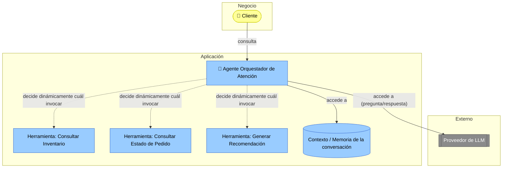

# 🧭 Patrón: Modelando Sistemas Agénticos

Un agente de IA **no es un elemento nuevo del metamodelo de ArchiMate** — se modela con los elementos que ya conoce de la [Guía de Notación ArchiMate](guia_notacion_archimate.md), pero siguiendo un patrón particular. Este documento complementa esa guía para cuando el AS-IS o el TO-BE de un cliente (Taller 3, Taller 7) incluye un agente de IA — un componente que orquesta herramientas y decide, muchas veces de forma autónoma y en varios pasos, cómo resolver una tarea.

---

## 1. El patrón: qué elementos usar y cómo se conectan

| Elemento | Rol en el patrón |
|---|---|
| Application Component "Agente Orquestador" | El componente que decide qué hacer, en qué orden y con qué herramienta |
| Application Service (uno por herramienta) | Cada capacidad que el agente puede invocar (ej. "Consultar Inventario", "Enviar Notificación") |
| Application Component externo "Proveedor de LLM" | El modelo de lenguaje que razona y decide — normalmente un servicio externo, igual que cualquier sistema de terceros ya visto en C4/ArchiMate |
| Data Object "Contexto / Memoria" | El historial de la conversación o el estado que el agente mantiene entre pasos |

**Lo que hace diferente a este patrón de un flujo tradicional:** en un proceso BPMN o un C2 convencional, el orden de las llamadas está fijo de antemano. En un agente, el orden en que se invocan las herramientas lo decide el modelo en tiempo de ejecución — por eso conviene anotar explícitamente esa relación como "decide dinámicamente" en vez de una simple secuencia.

---

## 2. Ejemplo guiado: Agente de Atención al Cliente en FarmApp

Continuando el caso de FarmApp (Talleres 7 a 9): se propone un agente que atiende consultas de clientes sobre disponibilidad de productos, estado de pedidos y recomendaciones, orquestando tres herramientas.

Nótese que el diagrama muestra explícitamente **cada herramienta que el agente puede invocar** — esto no es opcional: es la parte que después permite evaluar qué puede hacer el agente en el mundo real y con qué riesgo.

---

## 3. Riesgos específicos de sistemas agénticos

STRIDE (Taller 5) sigue aplicando, pero un agente introduce riesgos que STRIDE clásico no cubre bien:

| Riesgo | Descripción | Mitigación |
|---|---|---|
| Alucinación | El agente inventa información que no existe (ej. dice que hay stock cuando no lo hay) | No dejar que el modelo "invente" datos de negocio — que solo redacte una respuesta a partir de una consulta real a la herramienta correspondiente |
| Inyección de prompt (Prompt Injection) | Un usuario manipula la entrada para que el agente ignore sus instrucciones y ejecute acciones no autorizadas | Separar las instrucciones del sistema de la entrada del usuario; limitar qué herramientas puede invocar el agente según el contexto |
| Autonomía sin supervisión | El agente ejecuta una acción irreversible (ej. cancelar un pedido) sin confirmación humana | Definir qué acciones requieren aprobación humana ("human in the loop") antes de ejecutarse |
| Costo / gasto descontrolado | El agente entra en un bucle de llamadas al modelo o a herramientas, generando costos inesperados | Límite de iteraciones, presupuesto de tokens/llamadas por sesión, monitoreo de costo |
| Fuga de datos vía contexto | El agente incluye datos sensibles en el prompt que se envía al proveedor externo del LLM | Filtrar o anonimizar datos sensibles antes de enviarlos al modelo; exigir garantías contractuales de no-entrenamiento con esos datos |
| Falta de explicabilidad | No es posible auditar por qué el agente tomó una decisión específica | Registrar el razonamiento y las herramientas invocadas en cada paso (logs de ejecución del agente) |

---

## 4. Cómo se conecta con el resto del curso

- Estos riesgos se consolidan igual que los de STRIDE (Taller 5): como elementos **Requirement** en la capa de Motivación, que influyen sobre el Application Component del agente.
- Si el TO-BE de un cliente (Taller 7, Opportunities & Solutions) incluye un componente agéntico, este patrón es la referencia de cómo modelarlo y qué preguntas de riesgo hacerse — inclúyalo en la lluvia de ideas de mejoras como una opción tecnológica más, no como algo aparte.
- En la matriz de riesgos de 7 dominios (Taller 9), un riesgo agéntico normalmente cae en el dominio **Aplicaciones**; si el cliente tiene varios agentes en producción, puede tratarse como un dominio adicional propio en su matriz.

---

## 5. Errores comunes

| Error frecuente | Por qué es un problema | Cómo corregirlo |
|---|---|---|
| Modelar el agente como una "caja negra" sin mostrar qué herramientas invoca | Oculta justo el riesgo más importante: qué puede hacer el agente en el mundo real | Liste explícitamente cada herramienta/Application Service que el agente puede invocar |
| Evaluar los riesgos del agente solo con STRIDE genérico | Pierde riesgos específicos de sistemas agénticos (alucinación, autonomía, costo, explicabilidad) | Use la tabla de la sección 3 como complemento a STRIDE, no como reemplazo |
| No definir qué acciones requieren aprobación humana | Un agente autónomo mal diseñado puede ejecutar acciones irreversibles sin control | Explicite el "human in the loop" para acciones de alto impacto (pagos, cancelaciones, cambios de datos) |

---

## 6. Checklist de autoevaluación

- [ ] Se identificó cada herramienta que el agente puede invocar como un Application Service explícito.
- [ ] Se documentó qué modelo de lenguaje se usa y cómo se accede (Application Component externo).
- [ ] Se evaluaron los riesgos específicos de sistemas agénticos (alucinación, prompt injection, autonomía, costo, fuga de datos, explicabilidad), no solo STRIDE genérico.
- [ ] Se definió qué acciones del agente requieren aprobación humana antes de ejecutarse.

---

_Este patrón complementa la Guía de Notación ArchiMate del curso Arquitectura Empresarial — Universidad de La Sabana. Úselo únicamente cuando el sistema del cliente real incluya (o proponga) un componente agéntico; no es un elemento obligatorio del curso._
